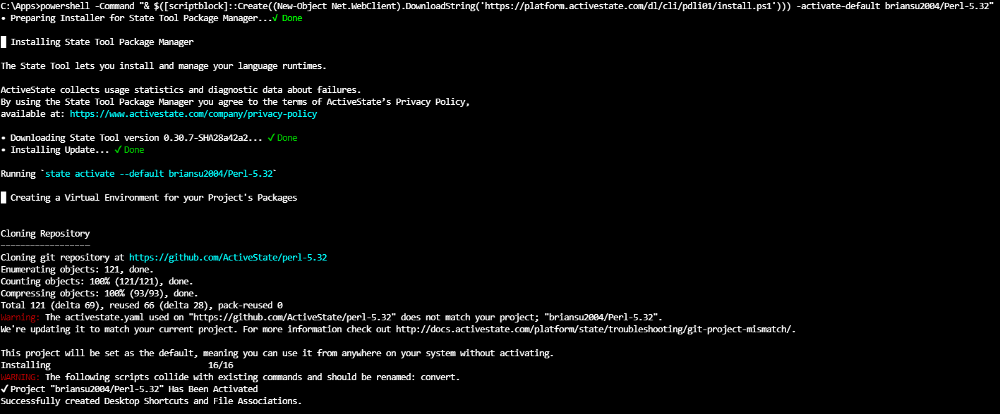
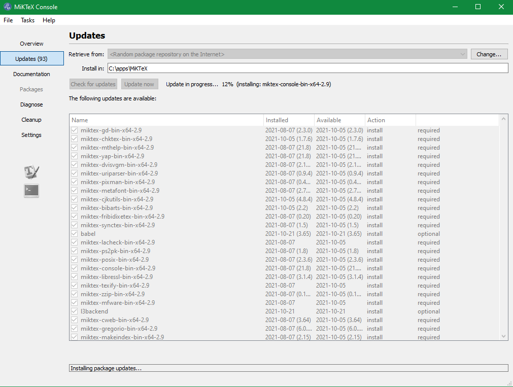
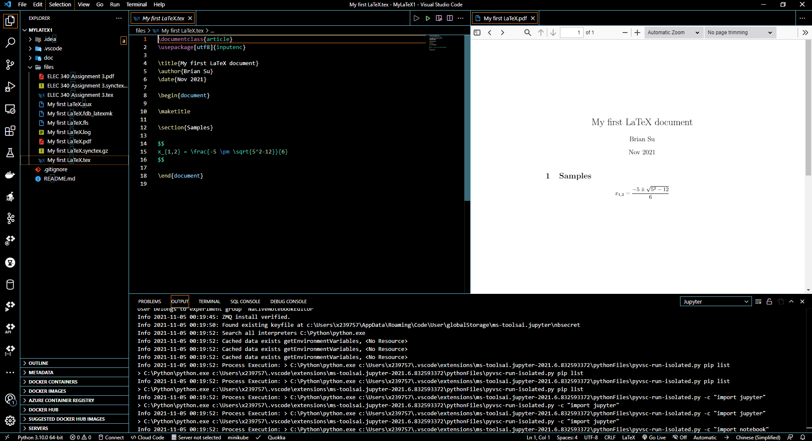
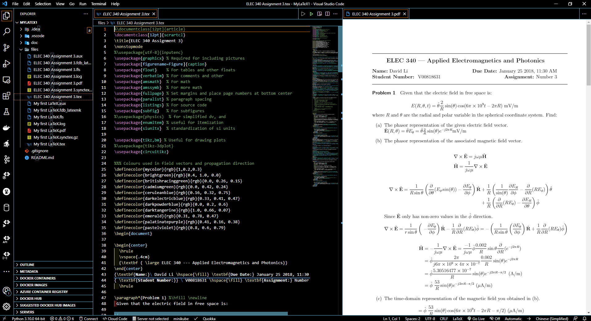

# My LaTeX

## Knowledge Points

LaTeX

## Set up

### Perl

MiKTeX's dependency

#### ActivePerl

Download and install ActiveState Perl -

```dos
powershell -Command "& $([scriptblock]::Create((New-Object Net.WebClient).DownloadString('https://platform.activestate.com/dl/cli/pdli01/install.ps1'))) -activate-default briansu2004/Perl-5.32"
```



### MiKTeX

- Check updates



- Update

### Visual Studio Code

Optional: LaTeX Extensions

### Online tools

- Overleaf

It helps on creating LaTeX documents.

- Beautiful math on Quora
  https://math-on-quora.surge.sh/

## Samples

### My first LaTeX



### ELEC 340 Assignment 3


